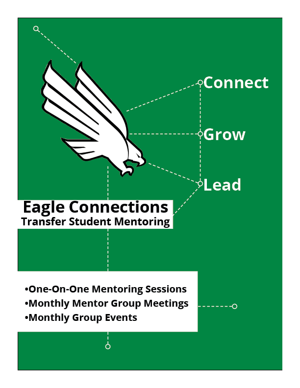

# Austin Stein's Resume

I started this resume using Figma about a month ago. The shapes I built are very intricate, each one is composed of several layers, and are a bit above the level I feel comfortable coding by hand at the moment. I uploaded a .PNG  instead. Looks pretty cool, right?

Bonus!!! Here's a portfolio piece I've been working on!

