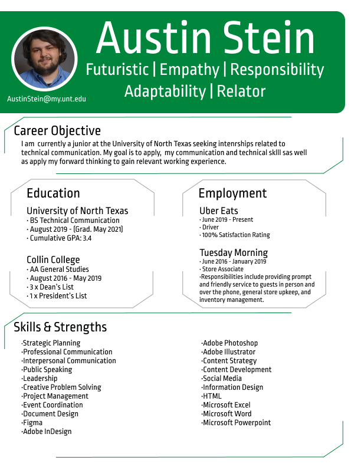

# Austin Stein's Resume

I made this resume this semester using Figma. The shapes I built are very intricate, and are a bit above where I feel comfortable coding by hand so I uploaded an image of my resume instead. 

